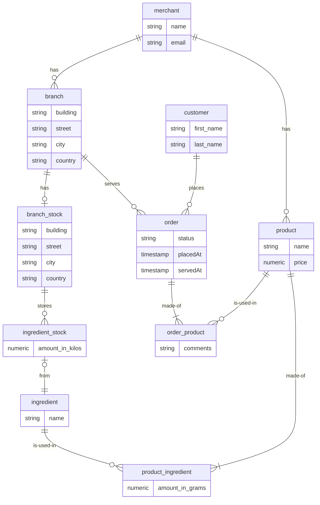

# Coding Challenge

> This is a system that is used by merchants and customers.
> The scope of this project is to implement the endpoint that accepts customer orders.
> - An order consists of one or more products, specifying the quantity ordered for each.
> - The system approves the order if the branch's stock contains enough ingredients for all the order products.
> - If the order is approved, the branch's stock of each used ingredient is decremented.
> - When an ingredient in branch's stock of is consumed and hits the 50% threshold, 
> an alerting email is to be sent to the merchant (only the first hit per ingredient should trigger the email)

> - Ingredients are global for the entire system
> - Each product has ingredients with specified amounts
> - Each merchant has their own products
> - Each merchant has one or more branches
> - Each branch has its own stock

# Development Approach
> I decided to implement this challenge in test driven development (TDD)
1. Writing test cases for each of the requirements, these test cases should fail (no implementation yet).
2. Implement the simplest code possible to make the test cases pass.
3. Refactor the code and make sure no test cases are broken as a result.

# CI
> I added a very simple CI pipeline using Github Actions to run the test suite and build the project's artifact and publish it to Github packages.

# Database design
> **Disclaimer:** I draw an initial ERD after reading the requirements to get an insight of how this can be modeled,
> but I will implement them as I go with each test case using TDD as mentioned above, so the actual implementation may simplify or improve on this
> design. Will update the ERD to reflect any changes.

> PKs, FKs, and indexes are not shown in the diagram for simplicity.

